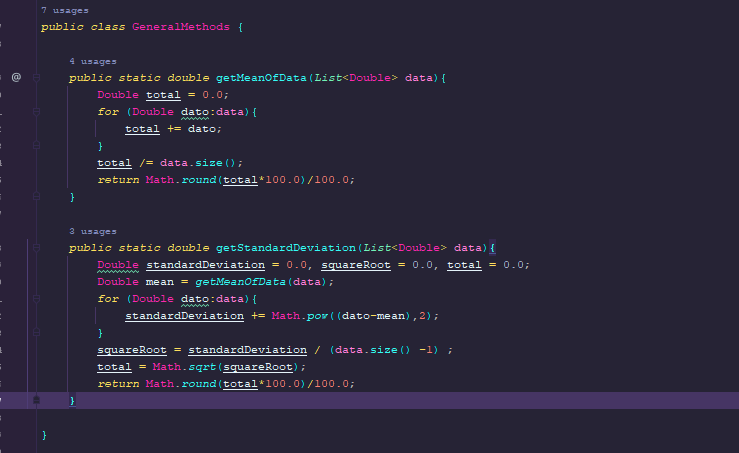
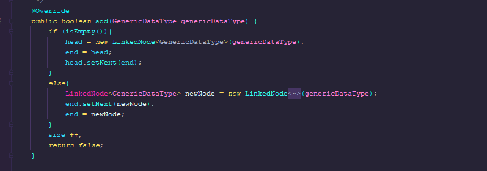
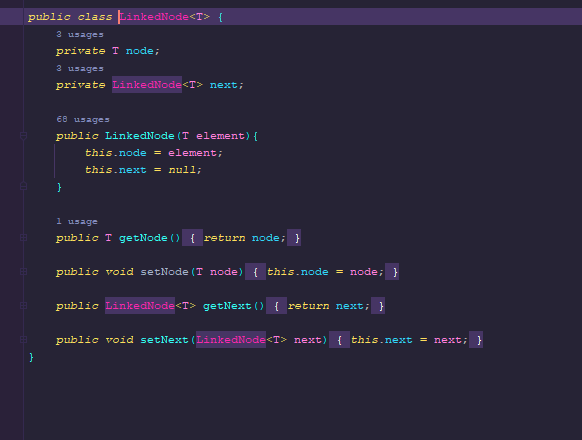

# Introduction

Un aplicativo simple que calcula el promedio y la desviacion estandar de un conjunto de valores dado en un archivo de texto

## Autor

**Brayan Camilo Castiblanco**

## Introducción
En este laboratorio se busca hacer un código que busque la media y la desviación estándar según un archivo txt, teniendo como entrada solo la ubicacion del directorio


## Strategy

La estrategia se basó en seguir las instrucciones del profesor, comenzar por el API de java y de allí se parte a la implementación de la solución.


## Description
En el directorio `src.main.jav.edu.escuelaing.arsw.Taller`, se encuentra la clase principal llamada `LinkedList` con el método main este método llamada a la clase `GeneralMethods`
la cual tiene los principales métodos llamados `getMeanOfData` y `getStandardDeviation` que generan la media y desviación estándar con la ayuda de la clase Linked List.




Se crea la clase Node



## Aclaración
La entrada de la App solamente es el nombre del archivo con su respectiva extensión.

## LOC/h.
+ Entendimiento del problema: **1 Hora**
+ Diseño del problema: **10 minutos**
+ Programación: **5 Horas - 6 horas**
+ Escritura del informe: **30 minutos**

## Pruebas

Para verificar las pruebas simplemente corremos el comando:

```
mvn test
```


### JAVADOC

La documentacion del aplicativo se puede ver directamente en el archivo `index.html` encontrado en la carpeta resources/apidocs.


### Diagrama de clases

El diagrama completo se puede encontrar en el archivo `Taller2ARSW.asta` 


